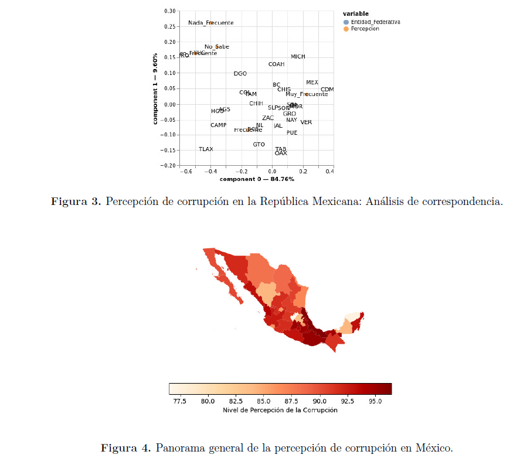
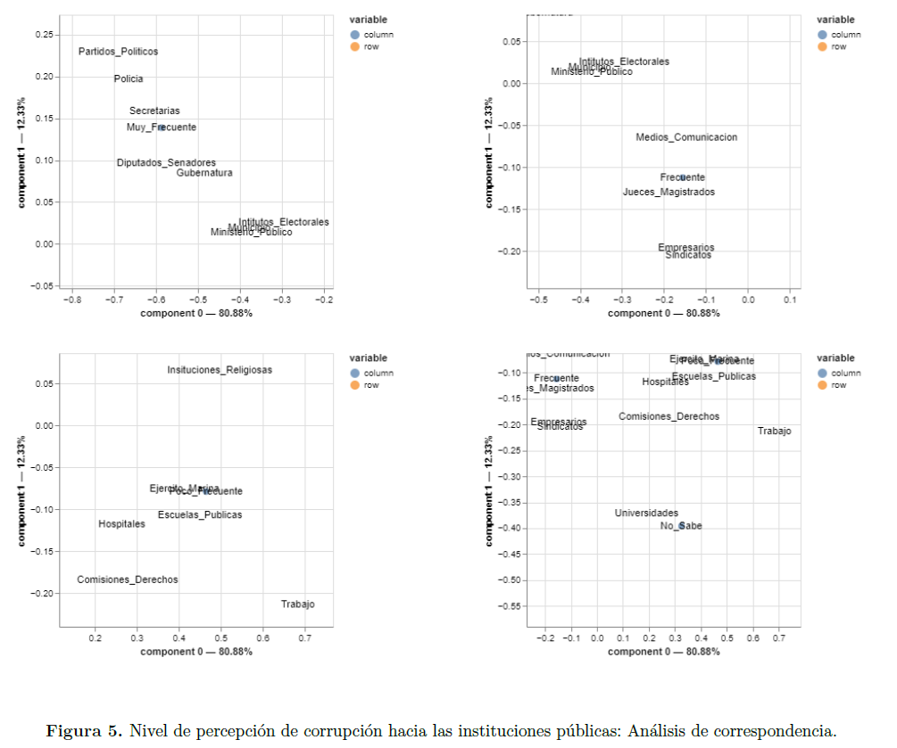

# Percepción de la población mexicana acerca de la corrupción en el país  
*(Análisis de la Encuesta Nacional de Calidad e Impacto Gubernamental 2017)*

En este proyecto se realizó un análisis de datos de la **Encuesta Nacional de Calidad e Impacto Gubernamental (ENCIG)**, levantada por el **Instituto Nacional de Estadística y Geografía (INEGI)** en el año 2017.

## Datos

La ENCIG tiene como objetivo evaluar la **percepción y experiencia de la población** respecto a la calidad de los servicios públicos y la corrupción en diversas instituciones gubernamentales.  

Este levantamiento permite examinar:  
- La evaluación de servicios públicos básicos y bajo demanda.  
- Las experiencias de la población con pagos, trámites y solicitudes de servicios públicos.  

La base de datos cuenta con diversas tablas que abarcan diferentes aspectos del estudio. Para este análisis se consideraron principalmente tres:  
- **Tabla del hogar principal y características del elegido**  
- **Tabla de seguimiento a trámites, pagos o servicios públicos**  
- **Tabla de confianza en las instituciones**  

## Enfoque de solución

El **Análisis de Correspondencia (CA)** fue la herramienta principal, dado que es muy útil para trabajar con datos categóricos. Los gráficos obtenidos mediante CA respaldaron los hallazgos descriptivos iniciales. 

Los análisis se organizaron en torno a tres temas principales:  
- Principales problemáticas de cada entidad federativa en México.  
- Nivel de percepción de la corrupción y confianza ciudadana en las instituciones públicas.  
- Experiencias relacionadas con pagos, trámites y solicitudes de servicios públicos.  

## Resultados

Los resultados muestran que una de las problemáticas más generalizadas en el territorio mexicano es la **corrupción**, directamente vinculada con el **nivel de confianza ciudadana en las instituciones públicas**.  

## Archivos del repositorio

- **reporte.pdf**  
  Documento con los resultados del análisis descriptivo y estadístico.  

- **codigo.ipynb**  
  Implementación del Análisis de Correspondencia (CA y MCA).  

- **encig2017_01_sec_11, encig2017_01_sec1_3_4_5_8_9_10 y encig2017_04_sec_7.dbf**  
  Archivos de base de datos correspondientes a:  
  - Tabla de confianza en las instituciones.  
  - Tabla del hogar principal y características del elegido.  
  - Tabla de seguimiento a trámites, pagos o servicios públicos.  

---

*Los datos pueden encontrarse en el siguiente enlace:*  
[ENCIG 2017 - INEGI](https://www.inegi.org.mx/programas/encig/2017/)

